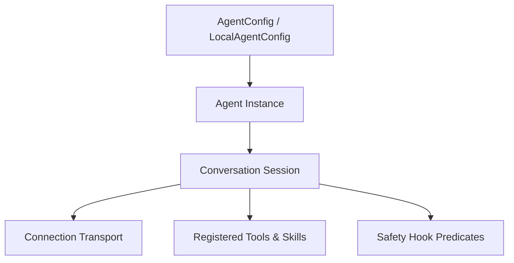

# Google Antigravity SDK Agent Template

This document provides guidelines for programmatic creation, configuration, and audit of custom AI agents using the **Google Antigravity SDK**.

---

## 1. Core SDK Architecture

Every agent created with the SDK is instantiated using a hierarchical configuration structure:



- **`LocalAgentConfig`**: Standard local development configuration. Automatically looks up `GEMINI_API_KEY` and defaults to the `gemini-3.5-flash` model.
- **`app_data_dir`**: The absolute path where agent logs, scratch files, and generated artifacts are stored. Defaults to `~/.gemini/antigravity/brain/` but can be overridden.
- **`Conversation`**: The context container tracking turn-by-turn history, performing context compaction, and handling response streaming.

---

## 2. Safety Hooks & Predicate Construction

Safety policies are evaluated in order of precedence: **Specific Deny/Ask/Allow** followed by **Wildcard Deny/Ask/Allow**.

### Custom Policy Example
To restrict an agent's commands so that it only runs test suites:

```python
from google.antigravity import Agent, LocalAgentConfig
from google.antigravity.hooks import policy

# Policy: Allow 'go test' but deny any other shell commands
allow_testing = policy.allow(
    "run_command",
    when=lambda args: args.get("CommandLine", "").startswith("go test"),
    name="allow_go_test"
)

deny_other_commands = policy.deny("run_command")

config = LocalAgentConfig(
    system_instructions="You are a verification assistant.",
    policies=[
        allow_testing,
        deny_other_commands,
        policy.workspace_only(["/Users/dhushon/work/daml-escrow"])
    ]
)
```

---

## 3. Tool Verification Matrix

All SDK agents have access to these built-in capabilities:

- **`view_file`**: Reads files from the workspace. confined by `policy.workspace_only()`.
- **`edit_file` / `write_to_file`**: Modifies/writes files. Requires explicit workspace matching.
- **`run_command`**: Runs system commands. Denied by default; must be explicitly whitelisted or configured with an `ask_user` callback handler.
- **`start_subagent`**: Delegates sub-tasks to nested agents with inherited policies.

---

## 4. Auditing & Safety Checklist

Before deploying a custom programmatic agent in the workspace, you MUST:
1. **Verify Credentials:** Ensure `GEMINI_API_KEY` is loaded securely and never hardcoded in scripts.
2. **Review Policies:** Ensure the agent's policy chain does not use `policy.allow_all()` in production environments.
3. **Verify App Data Path:** Confirm that `app_data_dir` is configured to an absolute path inside the project to allow clean file cleanups.
4. **Log Tracing:** Enable observability logs to monitor token usage and confirm that all tool executions are audited.
