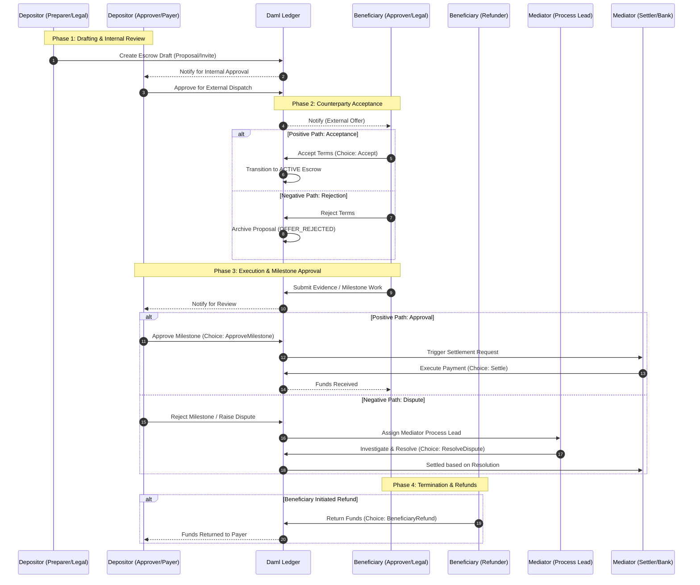
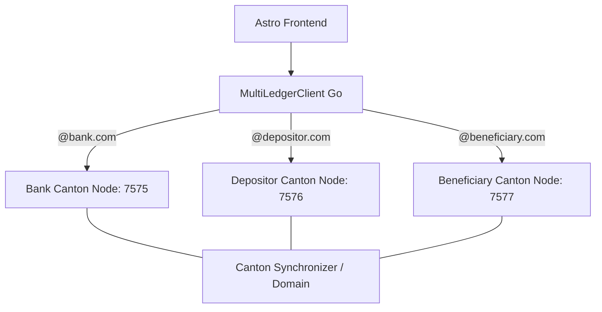
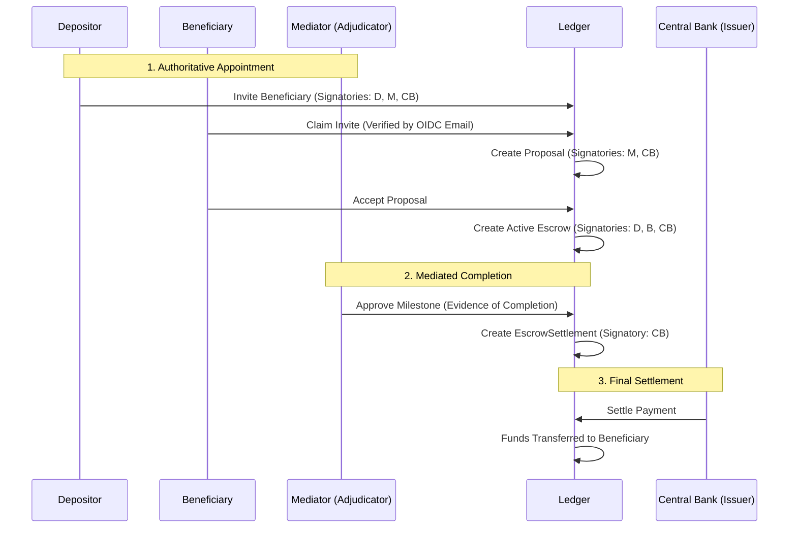
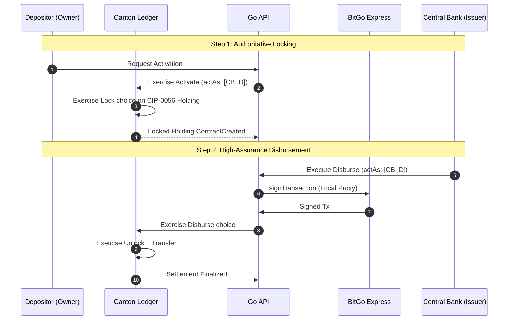
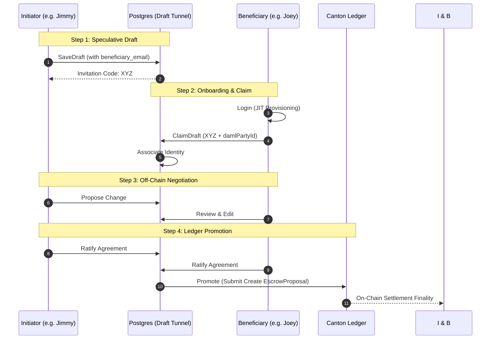
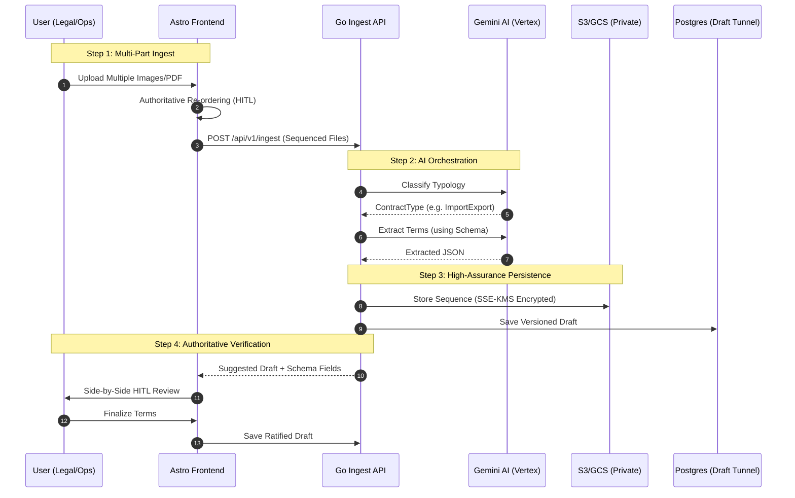

# Architecture Evolution: Multi-Actor Lifecycle

This document elaborates on the detailed roles and state transitions within the Stablecoin Escrow platform.

## 1. Role-Based Workflow Matrix

The following diagram illustrates the granular interactions between Depositor, Beneficiary, and Mediator roles across the contract lifecycle.

## 2. Distributed Sovereignty API Pattern (Phase 6 Completed)

To achieve maximum security and regulatory isolation, the platform has transitioned to a **Distributed Service Topology**.

### A. Architectural Goals
*   **Zero-Trust Isolation:** Each participant (Bank, Depositor, Beneficiary) operates their own Canton node. 
*   **Node Specialization:** Parties are "pinned" to their respective nodes. Command submission is only possible through the node hosting the party.
*   **Multi-Node Routing:** The `MultiLedgerClient` intelligently routes commands to the correct node based on the user's role and identity.
*   **Cross-Node Visibility:** Topology is synchronized across the cluster using the Synchronizer Topology Store, enabling observers on one node to see contracts created on another.

### B. Deployment Strategy

### C. Key Technical Breakthroughs (Phase 6)
1.  **Tripartite Topology Authorization:** Explicit `propose` and `authorize` transactions ensure that all three nodes agree on party hosting before command submission.
2.  **Deterministic Topology Propagation:** Replaced temporal `sleep` calls with algorithmic checks in both the Canton bootstrap script and the Go client `Discover()` phase.
3.  **Unified Party Mapping:** The `MultiLedgerClient` aggregates party IDs from all participants into a single cache and synchronizes it back to all children, preventing `UNKNOWN_SUBMITTERS` errors.
4.  **Resilient Identity Provisioning:** `GetIdentity` probes all nodes in the cluster to resolve users, ensuring high availability even if a node is temporarily unreachable.

---

## 3. Decision Log & Branching

### A. The Preparer-Approver Loop (Internal Governance)

By separating the **Contract Preparer** from the **Depositor Approver**, we enforce a "four-eyes" principle. A preparer (typically a procurement officer) can define terms, but only an authorized officer (Payer) can commit funds to the ledger.

### B. Business Email Logic (Onboarding)

When an invitation is issued to `user@datacloud.com`, the platform:

1. **Extracts Domain:** Validates the suffix `datacloud.com`.
2. **Associates Organization:** Automatically tags the invitation with the "DataCloud LLC" metadata.
3. **Applies Corporate Policy:** Only users with the correct domain can claim specific roles.

### C. Negative Outcomes & Resolution

- **Term Deadlock:** If Beneficiary Legal (`BA`) finds terms non-compliant, the proposal is archived.
- **Milestone Gridlock:** If Depositor Approver (`DA`) rejects work, the **Mediator Process Lead** (`ML`) adjudicates the dispute using on-ledger evidence.

## Phase 5: High-Assurance Identity & Adjudication (Completed)

### Architectural Shift: The Adjudicator Model

Moved from a simple "Depositor releases funds" model to a mediated "State Actor" model. Stakeholders (Depositor, Beneficiary, Issuer) sign the agreement, while an independent Adjudicator (Mediator) authoritatively backs the evidence of completion.

## Phase 9: High-Assurance Identity & Deep Health (Active)

Transitioned the platform from a "Sandbox" model to a production-ready infrastructure with cryptographically verified identity and multi-system diagnostics.

### Key Architectural Enhancements:
1.  **OIDC Identity Bridge:** Implemented strict JWT validation against Okta JWKS. External identity assertions now drive Just-In-Time (JIT) ledger provisioning.
2.  **Deep Health Aggregator:** Created a recursive diagnostic engine that aggregates the state of Postgres, Canton, and Oracle sub-systems with latency tracking.
3.  **Directory Service:** Added a live counterparty discovery mechanism, allowing users to select authorized participants directly from the ledger.
4.  **Production CLI:** Migrated the Go API to a professional Cobra/Viper structure, supporting environment-aware configuration via flags and YAML.
5.  **Infrastructure-as-Code:** Automated the entire identity stack (Apps, Servers, Users) using Terraform.

*   **Outcome:** A secured, observable platform capable of federating with enterprise Identity Providers and providing real-time system integrity reports.

## Phase 10: Institutional Stablecoin & CIP-0056 (Active)

Transitioned the ledger data model from simple numeric balances to authoritative cryptographic holdings, enabling integration with institutional providers like BitGo and Circle.

### Key Architectural Enhancements:
1.  **CIP-0056 Standard:** Adopted standardized Daml interfaces (`Holding`, `Lockable`, `Transferable`) to ensure that all token movements are ledger-verified and provider-agnostic.
2.  **Institutional Vault Model:** Refactored the stablecoin abstraction to use **Vaults** (mapping to BitGo Enterprise Wallets) rather than logical internal wallets.
3.  **Authoritative Locking:** Implemented a high-assurance state machine where escrowed assets are cryptographically locked during the `ACTIVE` phase, preventing double-spending and ensuring sole ledger authority over disbursement.
4.  **Multi-Actor Co-signing:** Aligned the Go and Daml layers to support multi-party authorizations (`actAs []string`), requiring both the **Issuer (Bank)** and **Depositor (Owner)** to authorize critical state transitions on institutional holdings.
5.  **BitGo Integration:** Implemented the `BitGoStablecoinProvider` using the BitGo v2 REST API and BitGo Express local proxy for secure transaction signing.

### Authoritative Lock & Disburse Flow:

*   **Outcome:** A production-ready financial backbone capable of handling real-world tokenized assets with institutional-grade security and bilateral authority.

## Phase 12: High-Assurance Governance & Off-Chain Negotiation (Active)

Transitioned the platform to a professional institutional grade with strict governance tiers and cost-optimized bipartite negotiation.

### Key Architectural Enhancements:
1.  **3-Tier Terraform Governance:** authoritatively refactored the infrastructure into three distinct security perimeters:
    *   **Tier 1 (Admin):** Cloud-native Root of Trust (GCP CAS, Audit, DNS).
    *   **Tier 2 (Workload):** Tripartite Orchestration (GKE, KMS, Registry).
    *   **Tier 3 (Identity):** External Federation (Okta, SAML).
    *   **Outcome:** Enforced strict principle separation and least-privilege operations, fulfilling the definitive SOC2 readiness mandate.
2.  **Off-Chain Negotiation Tunnel:** implemented a high-assurance bipartite negotiation layer in **Postgres (`draft_escrows`)**.
    *   **Zero-Latency Handshake:** Parties iterate on terms, milestones, and mediators off-chain with instant feedback and zero ledger transaction fees.
    *   **Invitation Bridge:** uses secure **Registration Codes** to bridge novel email-based identities to real ledger principals upon JIT provisioning.
3.  **Institutional Persistence:** hardened the GKE tripartite ledgers with **SSD-Premium Persistence (Premium RWO)** and sidecar database initialization.
4.  **Resilient JIT Status:** Synchronized the backend "Fast Identity Recovery" with a frontend **Progress Status Bar**, authoritatively informing users of their ledger allocation state during the authentication handshake.

### Bipartite Draft-to-Ledger Flow:

*   **Outcome:** A cost-efficient, high-performance institutional platform that balances human-scale negotiation with cryptographic ledger finality.

## Phase 13: Intelligent Ingest & High-Assurance Storage (Active)

Transitioned the platform to authoritatively bridge legacy legal prose with DAML smart contracts and enforced production-grade document privacy.

### Key Architectural Enhancements:
1.  **AI Ingest Engine:** Integrated **Gemini-2.0-flash** to authoritatively classify and extract structured terms from multi-page agreements (PDF/PNG/TIFF).
2.  **Contract Typology:** Implemented a **Schema-Driven Extensibility** model where domain-specific metadata (Import/Export, Real Estate, Grants) is validated against authoritative JSON schemas before ledger commitment.
3.  **Valet Storage Pattern:** implemented a high-assurance object storage model using **GCS (Production)** and **MinIO (Local)**.
    *   **Authoritative Privacy:** All document blobs are stored in private buckets with zero public access. 
    *   **Time-Limited Access:** The backend authoritatively "signs" access tokens (Presigned URLs) only for verified contract parties, valid for short durations (e.g., 15 minutes).
    *   **Encryption at Rest:** Enforced **SSE-KMS (GCP CMEK)** hardware-backed encryption for all institutional document blobs.
4.  **Enriched Identity Modeling:** expanded the institutional directory to capture **Titles**, **Corporate Affiliations**, and **KYC Status**, ensuring on-chain provenance matches real-world legal signatories.

### Intelligent Ingest & Verification Flow:

*   **Outcome:** A high-fidelity bridge between institutional legal documents and cryptographic smart contracts, ensuring privacy and compliance at scale.
