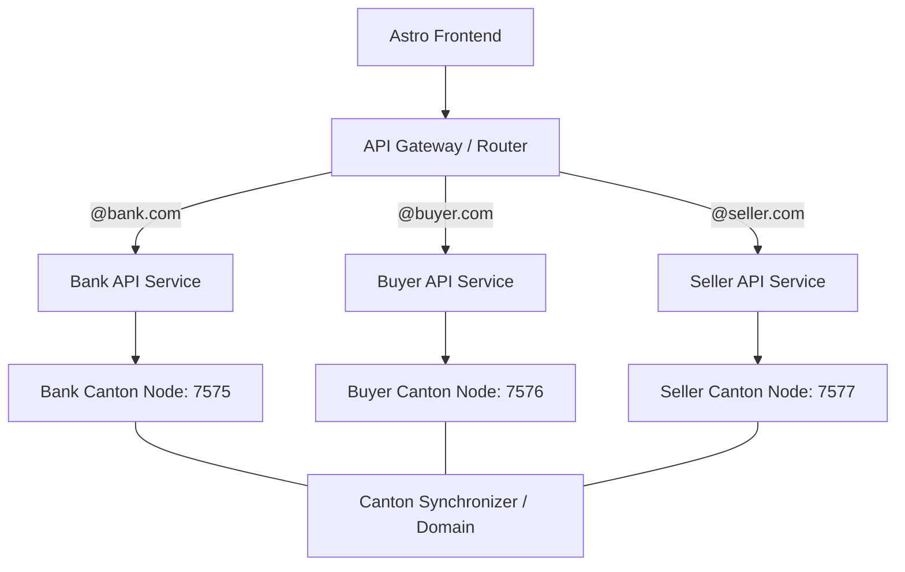
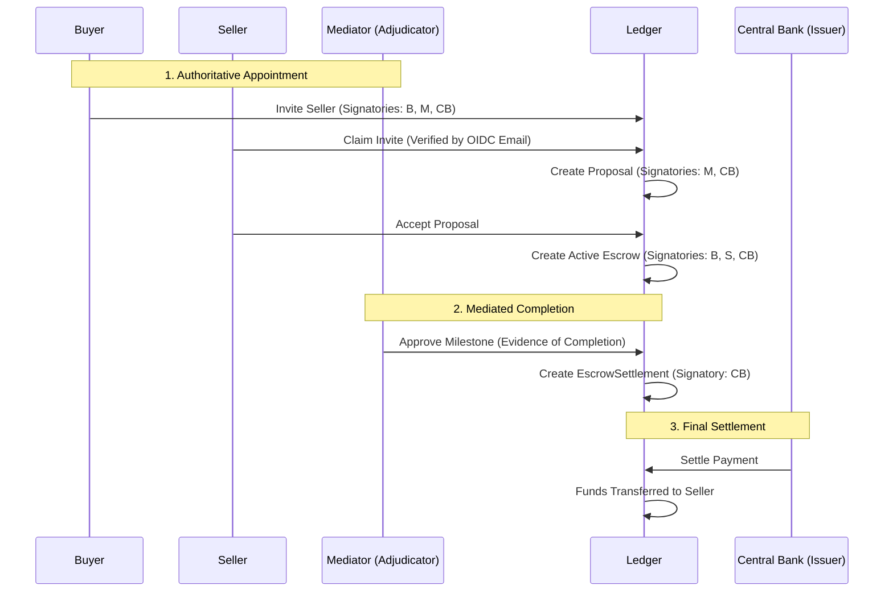

# Architecture Evolution: Multi-Actor Lifecycle

This document elaborates on the detailed roles and state transitions within the Stablecoin Escrow platform.

## 1. Role-Based Workflow Matrix

The following diagram illustrates the granular interactions between Buyer, Seller, and Mediator roles across the contract lifecycle.

## 3. Distributed Sovereignty API Pattern (Future Phase)

To achieve maximum security and regulatory isolation, the platform will transition from a single API Gateway to a **Distributed Service Topology**.

### A. Architectural Goals
*   **Zero-Trust Isolation:** Each API service instance is "pinned" to exactly one Canton node and one set of regulatory credentials (Bank, Buyer, or Seller).
*   **Universal Ledger SDK:** A shared internal Go package (`internal/ledger`) ensures all services interact with the ledger identically, maintaining consistency without duplication.
*   **Role-Based Routing:** An intelligent API Gateway (e.g., Nginx, Traefik, or AWS ALB) inspects the user's JWT claims and routes traffic to the correct service.

### B. Deployment Strategy

### C. Execution Plan
1.  **Containerization:** Decouple `escrow-api` from hardcoded node settings. Use environment variables (e.g., `LEDGER_NODE_ROLE=bank`) to determine the specific node context.
2.  **Service Registry:** Each node instance registers its endpoint in a central service discovery tool.
3.  **Gateway Policy:** Implement a Lua or Envoy filter to parse the `sub` or `email` claim from the OIDC token and forward the request to the correct downstream service.

---

## 4. Decision Log & Branching

### A. The Preparer-Approver Loop (Internal Governance)

By separating the **Contract Preparer** from the **Buyer Approver**, we enforce a "four-eyes" principle. A preparer (typically a procurement officer) can define terms, but only an authorized officer (Payer) can commit funds to the ledger.

### B. Business Email Logic (Onboarding)

When an invitation is issued to `user@datacloud.com`, the platform:

1. **Extracts Domain:** Validates the suffix `datacloud.com`.
2. **Associates Organization:** Automatically tags the invitation with the "DataCloud LLC" metadata.
3. **Applies Corporate Policy:** Can enforce that only an `@datacloud.com` authenticated user can claim the role of "Seller Approver."

### C. Negative Outcomes & Resolution

- **Term Deadlock:** If Seller Legal (`SA`) finds terms non-compliant, the proposal is archived. The system tracks this as a "Lost Opportunity" in metrics.
- **Milestone Gridlock:** If Buyer Approver (`BA`) rejects work but Seller refuses to redo it, the **Mediator Process Lead** (`ML`) uses the Evidence metadata stored on-ledger to determine a fair payout ratio.

## Phase 5: High-Assurance Identity & Adjudication (Completed)

### Architectural Shift: The Adjudicator Model

Moved from a simple "Buyer releases funds" model to a mediated "State Actor" model. Stakeholders (Buyer, Seller, Issuer) sign the agreement, while an independent Adjudicator (Mediator) authoritatively backs the evidence of completion.

### Key Technical Enhancements

1. **Dynamic Discovery:** Eliminated hardcoded IDs. The backend now resolves Package and Party IDs at runtime via `ledger-state.json` or active metadata discovery.
2. **OIDC-Daml Mapping:** Unified external identities (Google sub) with internal ledger handles (Daml User ID), ensuring authoritative matching.
3. **Thread-Safe Multi-Tenancy:** Refactored the ledger client to support concurrent, independent user sessions without identity bleed.
4. **Stakeholder Parity:** Both stakeholders can authoritatively raise disputes, ensuring balanced power dynamics.
