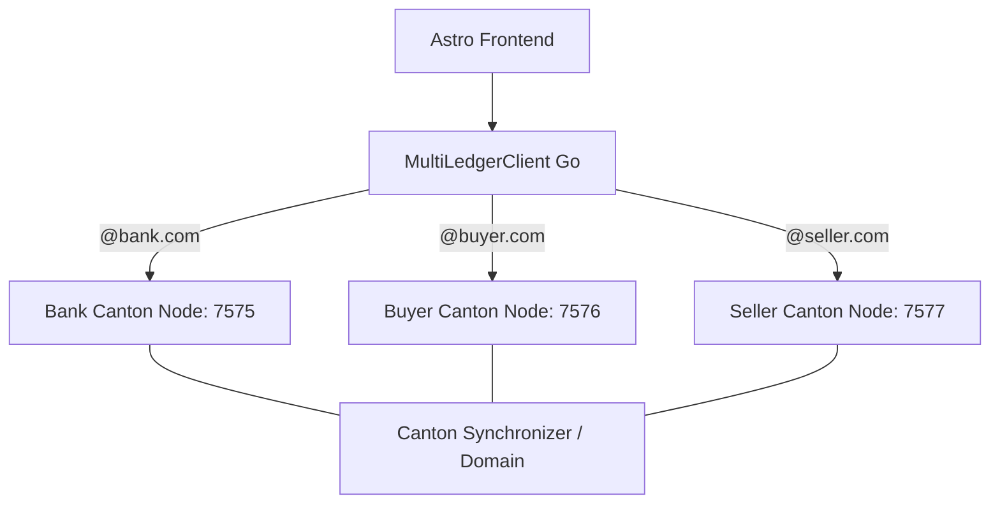
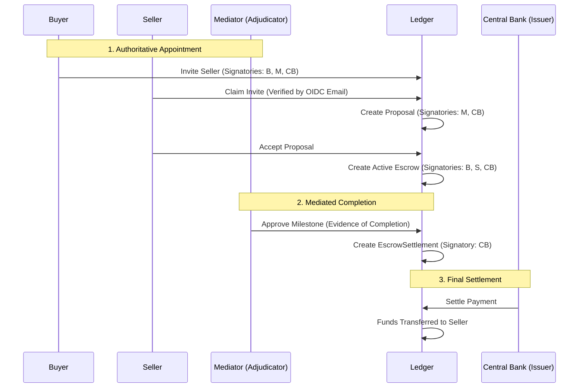

# Architecture Evolution: Multi-Actor Lifecycle

This document elaborates on the detailed roles and state transitions within the Stablecoin Escrow platform.

## 1. Role-Based Workflow Matrix

The following diagram illustrates the granular interactions between Buyer, Seller, and Mediator roles across the contract lifecycle.

## 2. Distributed Sovereignty API Pattern (Phase 6 Completed)

To achieve maximum security and regulatory isolation, the platform has transitioned to a **Distributed Service Topology**.

### A. Architectural Goals
*   **Zero-Trust Isolation:** Each participant (Bank, Buyer, Seller) operates their own Canton node. 
*   **Node Specialization:** Parties are "pinned" to their respective nodes. Command submission is only possible through the node hosting the party.
*   **Multi-Node Routing:** The `MultiLedgerClient` intelligently routes commands to the correct node based on the user's role and identity.
*   **Cross-Node Visibility:** Topology is synchronized across the cluster using the Synchronizer Topology Store, enabling observers on one node to see contracts created on another.

### B. Deployment Strategy

### C. Key Technical Breakthroughs (Phase 6)
1.  **Tripartite Topology Authorization:** Explicit `propose` and `authorize` transactions ensure that all three nodes agree on party hosting before command submission.
2.  **Deterministic Topology Propagation:** Replaced temporal `sleep` calls with algorithmic checks in both the Canton bootstrap script and the Go client `Discover()` phase.
3.  **Unified Party Mapping:** The `MultiLedgerClient` aggregates party IDs from all participants into a single cache and synchronizes it back to all children, preventing `UNKNOWN_SUBMITTERS` errors.
4.  **Resilient Identity Provisioning:** `GetIdentity` probes all nodes in the cluster to resolve users, ensuring high availability even if a node is temporarily unreachable.

---

## 3. Decision Log & Branching

### A. The Preparer-Approver Loop (Internal Governance)

By separating the **Contract Preparer** from the **Buyer Approver**, we enforce a "four-eyes" principle. A preparer (typically a procurement officer) can define terms, but only an authorized officer (Payer) can commit funds to the ledger.

### B. Business Email Logic (Onboarding)

When an invitation is issued to `user@datacloud.com`, the platform:

1. **Extracts Domain:** Validates the suffix `datacloud.com`.
2. **Associates Organization:** Automatically tags the invitation with the "DataCloud LLC" metadata.
3. **Applies Corporate Policy:** Only users with the correct domain can claim specific roles.

### C. Negative Outcomes & Resolution

- **Term Deadlock:** If Seller Legal (`SA`) finds terms non-compliant, the proposal is archived.
- **Milestone Gridlock:** If Buyer Approver (`BA`) rejects work, the **Mediator Process Lead** (`ML`) adjudicates the dispute using on-ledger evidence.

## Phase 5: High-Assurance Identity & Adjudication (Completed)

### Architectural Shift: The Adjudicator Model

Moved from a simple "Buyer releases funds" model to a mediated "State Actor" model. Stakeholders (Buyer, Seller, Issuer) sign the agreement, while an independent Adjudicator (Mediator) authoritatively backs the evidence of completion.

## Phase 9: High-Assurance Identity & Deep Health (Active)

Transitioned the platform from a "Sandbox" model to a production-ready infrastructure with cryptographically verified identity and multi-system diagnostics.

### Key Architectural Enhancements:
1.  **OIDC Identity Bridge:** Implemented strict JWT validation against Okta JWKS. External identity assertions now drive Just-In-Time (JIT) ledger provisioning.
2.  **Deep Health Aggregator:** Created a recursive diagnostic engine that aggregates the state of Postgres, Canton, and Oracle sub-systems with latency tracking.
3.  **Directory Service:** Added a live counterparty discovery mechanism, allowing users to select authorized participants directly from the ledger.
4.  **Production CLI:** Migrated the Go API to a professional Cobra/Viper structure, supporting environment-aware configuration via flags and YAML.
5.  **Infrastructure-as-Code:** Automated the entire identity stack (Apps, Servers, Users) using Terraform.

*   **Outcome:** A secured, observable platform capable of federating with enterprise Identity Providers and providing real-time system integrity reports.
