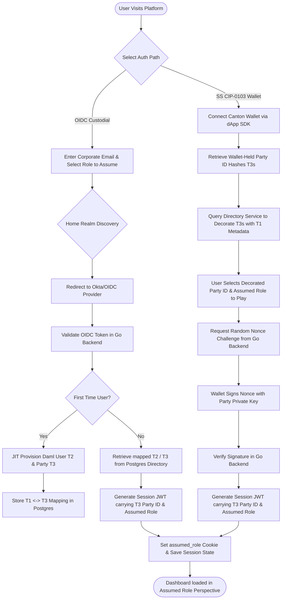

# Identity Strategy & Decentralized Onboarding

## Overview
This document defines the transition from a "Sandbox" identity model to a production-grade model driven by **Okta OIDC**, **Daml User Management**, and **Scoped Authorization**. The platform implements a high-assurance "Identity Bridge" that maps external identity assertions directly to Canton ledger permissions.

---

## 1. The Identity Mapping (OIDC to Daml)

We establish an "Identity Bridge" in the Go backend that translates external authentication into ledger authorization.

### Data Flow:
1.  **Authentication:** User logs into the Astro frontend. The system performs **Home Realm Discovery (HRD)** based on the email domain to select the correct provider (e.g., Okta for `gmail.com`, SAML for `bank.com`).
2.  **Credential:** The Identity Provider issues a JWT containing a `sub` (unique subject ID), `email`, and `scp` (scopes).
3.  **Validation:** The Go backend cryptographically verifies the JWT signature against the provider's **JWKS endpoint** using the `go-oidc` library.
4.  **Authorization:** The verified `sub` is sanitized and mapped to a **Daml User ID**.
5.  **JIT Provisioning:** If the user is new, the backend automatically allocates a new **Daml Party** and provisions a User with appropriate `actAs` rights derived from the JWT scopes.

---

## 2. JIT Provisioning & Permission Mapping

During implementation, the following high-assurance requirements for the Daml JSON API (V2) were integrated into the Just-In-Time (JIT) flow:

### A. Party Allocation (`POST /v2/parties`)
- **Field:** Use `partyIdHint` (not `identifierHint`).
- **Response:** The allocated party is found at `partyDetails.party`.

### B. User Creation (`POST /v2/users`)
External subjects are sanitized (e.g., `hushon@gmail.com` -> `u-hushon-gmail-com`) to meet Daml identifier requirements.
```json
{
  "user": {
    "id": "u-sanitized-sub",
    "primaryParty": "allocated-party-id",
    "isDeactivated": false,
    "identityProviderId": ""
  }
}
```

### C. Rights Mapping (Directive 11)
The backend translates OIDC scopes into cryptographic ledger rights:
- **Scope `system:admin`:** Automatically grants `actAs` rights for the **CentralBank** party, enabling institutional oversight and disbursement actions.
- **Default:** Every provisioned user is granted `actAs` rights for their own primary party.

### D. Enriched Signatory Profiles (Phase 13)
To bridge legal prose with digital identity, the platform authoritatively captures enriched signatory attributes during the Ingest/Verification phase:
*   **Signatory Attributes:** `Title`, `Affiliation` (Law Firm/Consultancy), `Organization`, and `PhysicalAddress`.
*   **KYC Governance:** A mandatory `KYCStatus` (PENDING, VERIFIED, REJECTED) is maintained in the institutional directory to ensure regulatory compliance before ledger commitment.
*   **On-Chain Provenance:** These attributes are authoritatively stored in the DAML contract's `metadata` blob, ensuring that the identity of the person who signed the legacy agreement is cryptographically linked to the ledger transaction.

---

## 3. Home Realm Discovery (HRD) Strategy

To support multi-tenancy and enterprise federation, the platform uses a domain-based discovery mechanism:

1.  **Lookup:** The frontend calls `/api/v1/auth/discover?email=user@domain.com`.
2.  **Mapping:** The `IdentityService` consults `config/identity_providers.yaml` to return the correct OIDC `issuer` or SAML `loginUrl`.
3.  **Origin Tracking:** The backend extracts the `origin_domain` claim from the JWT (with a fallback to the email suffix) to track which company asserted the user's identity.

---

## 4. Authorization Matrix (Scopes)

| Role | Scopes | Ledger Rights | Allowed Operations |
| :--- | :--- | :--- | :--- |
| **Viewer** | `escrow:read` | `readAs` | List/Get Escrows, Proposals, Invitations. |
| **Contributor** | `escrow:write` | `actAs (Self)` | Propose Escrow, Create Invitation. |
| **Participant** | `escrow:accept` | `actAs (Self)` | Accept Proposal, Ratify Settlement. |
| **Admin** | `system:admin` | `actAs (Bank)` | Settle (Bank), Activate, Disburse. |

---

## 5. Automated Identity Infrastructure

To ensure consistent testing and demonstration environments, the identity stack is managed as **Infrastructure-as-Code (IaC)**.

### A. Terraform Automation (`/terraform`)
The repository includes Terraform definitions to provision:
- **Okta OIDC Application:** Configured with correct redirect URIs and scopes.
- **Authorization Server:** Defines the `origin_domain` custom claim.
- **Groups:** Functional groups for `EscrowDepositors`, `EscrowBeneficiaries`, `EscrowMediators`, and `EscrowBank`.
- **Test Users:** Pre-provisions consistent personas with fixed credentials.

### B. Standard Test Personas
The following identities are automatically provisioned for Phase 9 testing:

| Persona | Role | Email |
| :--- | :--- | :--- |
| **Joey Depositor** | Payer | `joey@depositor.com` |
| **Jimmy Beneficiary** | Payee | `jimmy@beneficiary.com` |
| **Sally Mediator** | Adjudicator | `sally@mediator.com` |
| **Bob Banker** | Issuer | `bob@banker.com` |

**Common Password:** `Stablecoin2026!`

### C. Provisioning Script
Run the following to apply the infrastructure and verify the persona catalog:
```bash
./scripts/setup_test_users.sh
```

---

## 6. Dynamic Identity & Package Discovery

To maintain high assurance across contract upgrades and environment resets, the platform avoids hardcoding cryptographic identifiers. Instead, it employs a **Discovery Phase** at startup.

### Strategy:
1.  **Logical Mapping:** The backend maintains knowledge of "Logical Names" (e.g., package `stablecoin-escrow`, party `Depositor`).
2.  **Runtime Resolution:** Upon connection, the `ledgerClient.Discover(ctx)` method is executed.
3.  **Package Sync:** The system queries the ledger's package registry to resolve the current content-hashes (Package IDs) for interfaces and implementations.
4.  **Party Sync:** Cryptographic Party IDs are resolved via the User Management API and identifier hints, populating a high-speed local cache (`partyMap`).

This ensures that the Go backend always interacts with the exact versions of the contracts currently active on the Synchronizer.

---

## 7. CIP-0103 Wallet Integration & Progressive Custody

To support institutional participants requiring self-sovereign key management alongside traditional enterprise users, the platform implements a **Progressive Custody** identity model in compliance with the **Canton CIP-0103** standard.

### A. Dual Auth Paths
The system supports two user paths simultaneously, normalizing the active session into a unified session token (JWT):
*   **Traditional Custodial (Okta OIDC)**: Backend manages user credentials and automatically signs and submits DAML transactions to the ledger using native system identities.
*   **Self-Sovereign (CIP-0103 Wallet)**: User connects an external compatible wallet (e.g. Splice Wallet) via `@canton-network/dapp-sdk`. Transaction commands are generated by the backend and sent to the client to be signed and submitted by the wallet.

### B. Wallet-as-Identity (Sign-in with Wallet)
To securely authenticate a wallet with our off-chain API (for Drafts, Ingest, etc.), we enforce a cryptographic challenge-response handshake:
1.  **Nonce Generation**: The backend generates a cryptographically secure, random challenge string and persists it in the Postgres `auth_nonces` table.
2.  **Wallet Signing**: The frontend uses `sdk.signMessage(challenge)` to request the user's wallet to sign the challenge using their primary party private key.
3.  **Signature Verification**: The backend cryptographically verifies the signature (supporting Ed25519 and ECDSA) against the party public key.
4.  **Replay Mitigation**: Nonces are strictly **single-use** (deleted immediately upon evaluation) and are bound by a **5-minute expiration window**.

### C. Strict Session-to-Wallet Binding
To prevent critical transaction-context errors (e.g. initiating Company A's drafts using Company B's wallet):
*   **No Hot-Swapping**: A backend session is irrevocably bound to the specific `damlPartyId` verified at login.
*   **Frontend Event Invalidation**: The frontend actively monitors the dApp SDK for `accountChanged`, `chainChanged`, or `disconnect` events. If a change is detected, the frontend instantly destroys the local session token and redirects to `/login`.
*   **Backend Middleware Enforcement**: Any request attempting to perform actions with a mismatched session context is immediately rejected with a `401 Unauthorized` status.

### D. Payload Delegation DTOs
The backend remains the absolute source of truth for business logic. When a Wallet-authenticated session triggers a transaction:
1.  The Go handler interceptor (`isDryRun`) detects the `auth_method: "wallet"` claim.
2.  Instead of executing the action on-chain, the backend serializes the DAML command as an **Unsigned Payload DTO**:
    ```json
    {
      "isDryRun": true,
      "commands": [
        {
          "commandType": "exercise",
          "templateId": "StablecoinEscrow:Escrow",
          "contractId": "escrow-999",
          "choice": "activate",
          "argument": {}
        }
      ]
    }
    ```
    The frontend passes this command array directly to `sdk.prepareExecute(commands)` for standard wallet signing and submission, preventing "Blind Signing" manipulation risks.

---

## 8. Identity Decision Graph & UX Mapping

To bridge cryptographic ledger entities with intuitive human interactions, the platform implements a **Triple-Tier Identity Alignment** and a decorated user selection flow.

### A. Triple-Tier Identity Model
1.  **Registration Identity (T1):** The human/organizational level. Stored in Postgres (Okta `sub`, email, display name, organization).
2.  **Ledger User ID (T2):** The node-level authorization account (e.g. `u-joey-depositor-com`) containing specific ledger rights (`actAs`, `readAs`).
3.  **Canton Network Identity (T3):** The cryptographically addressable party hash (e.g. `Depositor::12207b5b...`). Used for template signatories and observers on-chain.

### B. Authentication & Role-Assumption Decision Graph



### C. UX Model: Party ID Decoration
Because raw Canton Party IDs are cryptographic hashes (e.g., `Depositor::12207b5b48bc6...`), showing them directly in the user interface is a severe UX hazard. 

To resolve this, the system enforces **Directory Decoration**:
1.  **Ledger Metadata Annotations:** On-chain, the JIT provisioner attaches annotations to User records (`email`, `role`).
2.  **Off-Chain Directory (Postgres):** The `identities` table is the definitive directory lookup.
3.  **API Enrichment:** When the frontend requests directories, counterparty lists, or escrow states, the Go backend intercepts T3 hashes and decorates them with T1 metadata:
    ```json
    {
      "damlPartyId": "Depositor::12207b5b...",
      "displayName": "Joey Depositor",
      "email": "joey@depositor.com",
      "organization": "Acme Corp",
      "role": "Depositor"
    }
    ```
4.  **UI Representation:** In selection boxes (e.g., counterparties in draft creation), the user sees `Joey Depositor (Acme Corp)` instead of the cryptographic hash, maintaining legal clarity and operational assurance.
