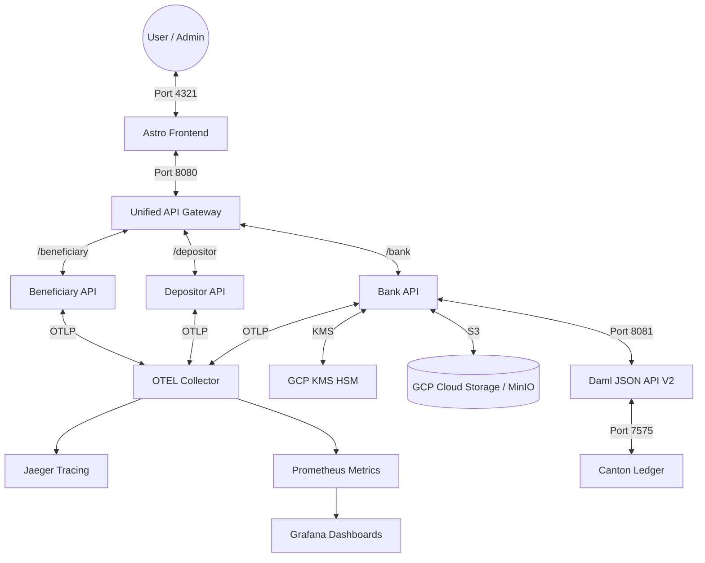
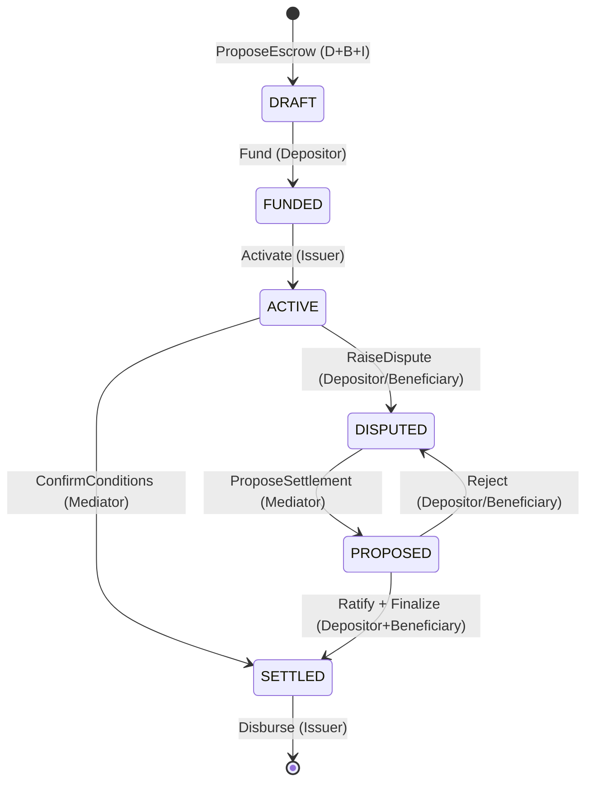

# Stablecoin Escrow Platform (DAML-Based)

## Overview

This project implements a **high-assurance, privacy-preserving stablecoin escrow platform** using **DAML (Digital Asset Modeling Language)** and a **Canton distributed ledger**. It follows a rigorous formal escrow process designed for tokenized reserves.

👉 **[Get Started with Installation & Setup](./GET_STARTED.md)**

------------------------------------------------------------------------

## High-Assurance Architecture

### System Stack

### High-Assurance Sovereignty & Observability

This platform implements a **Sovereign Tripartite Architecture**, ensuring each participant maintains data and compute isolation while providing unified operational visibility.

*   **Institutional Development:** The platform authoritatively mirrors the tripartite GKE topology in the local environment. See the **[Tripartite Development Guide](./docs/DEVELOPMENT.md)** for details on the orchestration model and service registry, and our chronological **[Architecture Evolution Ledger](./ARCHITECTURE_EVOLUTION.md)** for major system milestones.
*   **Unified API Gateway (Nginx):** A single, secure entry point (Port 8080) that authoritatively routes traffic to isolated participant namespaces (`/bank`, `/depositor`, `/beneficiary`).
*   **High-Assurance Object Storage:** Authoritative document persistence using **GCP Cloud Storage (GCS)** or **MinIO** for local parity.
    *   **Encryption at Rest:** Integrated with **SSE-KMS (GCP CMEK)** to ensure institutional document blobs are authoritatively encrypted using hardware-backed keys.
    *   **Privacy-First Access:** Utilizes a **"Valet" Presigned URL pattern**; documents remain in private buckets with zero public access. The backend authoritatively generates time-limited signed tokens only for verified contract parties.
*   **OpenTelemetry (OTEL) Integration:** Distributed tracing and real-time metrics capture the institutional request lifecycle across distributed nodes.
    *   **Authoritative Visibility:** See the **[Observability Guide](./docs/OBSERVABILITY.md)** for detailed telemetry flow diagrams and metrics dictionaries.
    *   **Jaeger Tracing:** Authoritative visualization of tripartite request spans tagged by `account.id`.
    *   **Grafana Dashboards:** Pre-provisioned dashboards for system health, account performance, and contract-level operational velocity.
*   **HSM-Backed Cryptography:** Authoritative settlement triggers are authoritatively proofed via **GCP Cloud KMS** hardware-backed asymmetric signatures.
*   **High-Assurance Identity:** Sovereign principal models (Contributor vs Deployment Service) are authoritatively codified. See our main **[Identity Registry](./IDENTITY.md)** and the synchronized **[Identity Registry Guide](./docs/IDENTITY.md)** for details on Okta, tripartite onboarding, and permissions.
*   **Networking & Ports:** Authoritative mapping for tripartite routing and observability. See the **[Networking Registry](./docs/NETWORKING.md)** for details.
* **Canton OpenZeppelin Stablecoin/CDP Module:** Utilizes production-ready Daml templates for Collateralized Debt Positions (CDP) and standard CIP-0056 holding mechanisms.
* **Validator APIs (Splice):** Employs high-level validator endpoints for automated escrow workflows and external party signing (e.g., trusted escrow agents).
* **Noves Data & Analytics:** Integrates real-time indexed data for tracking token holdings, transaction history, and wallet metrics across the Canton Network.
* **Frontend Platform & Design System (`cx-platform`):** Consumes external layout, theme, and LNF design tokens from `@vdatacloud/cx-commons` (see **[FRONTEND-PROCESS.md](./FRONTEND-PROCESS.md)**).

### Escrow Lifecycle (Formal Model)

Refined per the formal process specification **[ESCROW-PROCESS.md](./ESCROW-PROCESS.md)** to ensure bilateral consent and tripartite authority. For ledger-level details, see our **[Canton Ledger Design](./CANTON_LEDGER.md)** and **[DAML Contract Specification](./CONTRACT.md)**.

------------------------------------------------------------------------

## Key Features

### 1. Robust State Machine (Phase 5)

Strict transition guards ensure funds cannot be released until conditions are met or bilateral agreement is reached in a dispute.

* **DRAFT:** Terms agreed, but asset not yet deposited.
* **FUNDED:** Asset locked by Issuer, awaiting activation.
* **ACTIVE:** Escrow is live and conditions are being monitored.
* **DISPUTED:** Adjudication phase initiated.
* **PROPOSED:** Mediated settlement awaiting party ratification.

### 2. Distributed Sovereignty (Phase 6)

The platform has transitioned from a single-node sandbox to a **tripartite distributed topology**, enforcing strict data sovereignty and authority:

*   **Tripartite Authority Model:** Every escrow requires co-signature from **Depositor**, **Beneficiary**, and **Issuer (Bank)**. This prevents unauthorized state transitions and ensures institutional compliance.
*   **Multi-Node Isolation:** Each participant operates their own **Canton Node**, ensuring that private contract data (e.g., specific terms or evidence) only resides on the participants' infrastructure.
*   **Intelligent Routing:** The Go backend utilizes a `MultiLedgerClient` to intelligently route commands to the specific node hosting the primary submitter, maintaining zero-trust isolation.

### 3. CIP-0056 & Institutional Tokens

Native support for **CIP-0056** ensures the platform can interoperate with real stablecoins:
*   **Lockable Interface:** Assets are cryptographically locked in the escrow contract, preventing double-spending while the escrow is `ACTIVE`.
*   **Transferable Interface:** Final settlement triggers authoritative transfers using standardized token choices, ensuring compatibility with major institutional issuers.

### 4. Deep Health Diagnostics (Phase 9)

The Go backend aggregates real-time diagnostics from all critical sub-systems:
*   **Database:** Latency-aware connectivity checks.
*   **Ledger:** Verifies template availability and package propagation.
*   **Oracle:** Validates security credentials and trigger readiness.
The frontend dashboard provides a live cockpit for monitoring these states with 15s polling.

### 6. Off-Chain Negotiation & Bipartite Onboarding (Phase 12)

Evolved the bipartite handshake to support cost-optimized institutional negotiation before ledger commitment, detailed in our **[Off-Chain Negotiation Plan](./plans/OFF_CHAIN_NEGOTIATION_PLAN.md)**:
*   **Draft Tunnel:** Propose terms, milestones, and mediators in a high-speed Postgres intermediate layer with zero transaction fees.
*   **Invitation Codes:** Bridge novel email identities to real ledger principals using cryptographically secure registration codes.
*   **Postgres-to-Canton Promotion:** authoritatively commit to the ledger only when all three parties (Depositor + Beneficiary + Mediator) have definitively ratified the terms.

### 7. 3-Tier Terraform Governance (Phase 12)

Hardened the physical infrastructure orchestration with three distinct security perimeters:
*   **Tier 1 (Admin):** Manages the high-assurance cloud foundation (GCP Root CA, Audit Sinks, DNS).
*   **Tier 2 (Workload):** Orchestrates tripartite GKE nodes, KMS HSM keys, and pilot workloads.
*   **Tier 3 (Identity):** Dedicated to SAML/Okta institutional federation.
*   **Outcome:** Enforced strict principle separation and least-privilege operations, fulfilling the definitive SOC2 readiness mandate.

### 8. Intelligent Ingest & Contract Typology (Phase 13)

Introduced an AI-native ingestion engine to authoritatively bridge legacy legal prose with DAML smart contracts, outlined in our **[Intelligent Ingest Plan](./plans/INTELLIGENT_INGEST_PLAN.md)**:
*   **Multi-Stage AI Extraction:** Utilizes **Gemini-2.0-flash** to classify agreements and extract structured terms from multi-page PDFs or scanned images (PNG/TIFF).
*   **Contract Typology:** Authoritative industry-specific schemas (Import/Export, Real Estate, Grants) ensure metadata is validated against domain-specific standards before ledger commitment.
*   **HITL Verification:** High-fidelity Human-in-the-loop (HITL) UX with side-by-side original source and AI-extracted form for authoritative verification.
*   **Enriched Identity:** Authoritatively matches signatories against the institutional directory, capturing titles, corporate affiliations, and KYC status for on-chain provenance.

### 9. High-Assurance Read-Through Storage & Mirroring (Phase 16)

Implemented production-grade document privacy and sovereign storage mirroring, verified via our **[Storage Infrastructure Test Plan](./plans/STORAGE_INFRA_TEST_PLAN.md)**:
*   **Valet Storage Pattern:** High-assurance object storage using **GCS (Production)** and **MinIO (Local)** with zero public access.
*   **Read-Through Lazy Mirroring:** Document blobs are automatically and lazily "cached" in a party's local vault upon retrieval, avoiding complex synchronous replication protocols.
*   **Dynamic Re-signing:** Enforces time-limited, backend-signed **Presigned URLs** dynamically generated from the user's specific local vault for every fetch.
*   **SSE-KMS Encryption:** Enforces hardware-backed **Encryption at Rest** (SSE-KMS / GCP CMEK) for all institutional document blobs.
*   **Authoritative Object Tagging:** S3/GCS object tagging binds contract-id, depositor, and beneficiary identities directly to storage blobs, enabling cross-vault searchability.

### 10. CIP-0103 Wallet & Progressive Custody (Phase 17)

Aligned identity and wallet strategies with the **Canton Network CIP-0103 standard**, laid out in our **[CIP-0103 Integration Plan](./plans/CIP_0103_INTEGRATION_PLAN.md)**:
*   **Progressive Custody (Dual Path)**: Supports both traditional corporate users (Okta OIDC with server-side signing) and self-sovereign institutional users (Canton connected wallets with client-side signing) within a unified API gateway.
*   **Wallet-as-Identity**: Implements a secure cryptographic challenge-response login flow with single-use, 5-minute database nonces to prevent replay attacks.
*   **Strict Session-to-Wallet Binding**: Immutably binds a session to the verified wallet at login. If the dApp SDK detects a wallet disconnect or account change, the frontend instantly destroys the session and redirects to `/login`.
*   **Payload Delegation DTOs**: Backend remains the source of truth for business logic, generating dry-run DAML command payloads which the connected wallet signs and submits.
*   **Browser Wallet Emulator**: Native SubtleCrypto Ed25519 emulator built directly into the login page to enable zero-dependency local testing.

------------------------------------------------------------------------

## Analytics & Operational Velocity (Phase 6.3)

The platform integrates a high-assurance analytics layer powered by **Noves-ready logic** to provide real-time visibility into the escrow lifecycle.

### 1. The Operational Velocity Dashboard
Accessible via `/metrics`, this dashboard visualizes the platform's efficiency using:
*   **Stage Duration Heatmap:** Tracks the average minutes spent in each escrow state (`DRAFT`, `FUNDED`, `ACTIVE`, `PROPOSED`), identifying systemic bottlenecks.
*   **Conversion Funnel:** Visualizes the "drop-off" and success rate from initial proposal through to final settlement.
*   **System Health:** Real-time monitoring of P95/P99 latencies, command success rates, and ACS (Active Contract Set) size.

------------------------------------------------------------------------

## Repository Structure

* `/cmd`: Entry points for API and Oracle Simulator.
* `/internal`: Modular Go backend (Ledger Client, Service Layer, REST Handlers).
* `/contracts`: Multi-package Daml structure (Interfaces, Implementation, Tests).
* `/frontend`: Astro-based dashboard with DataCloud LNF styling.
* `/docs`: Authoritative institutional guides (Identity, Networking, Observability, Development).
* `/scripts`: Management and provisioning scripts.
* `ESCROW-PROCESS.md`: The formal process specification.
* `REGULATORY_CONFORMANCE.md`: Details on GDPR/CCPA and data sovereignty.
