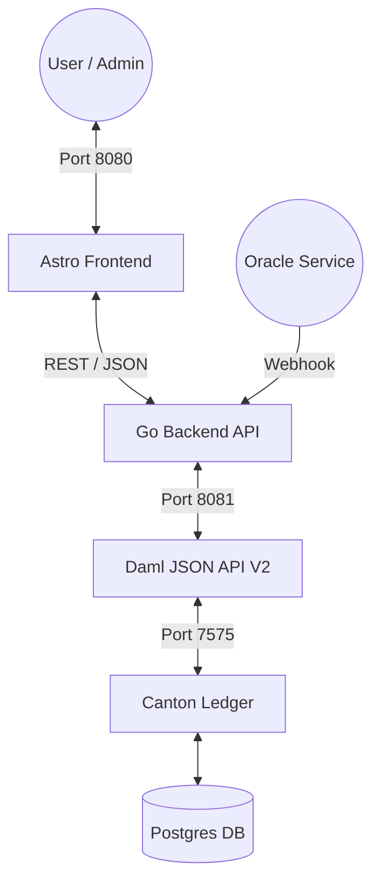
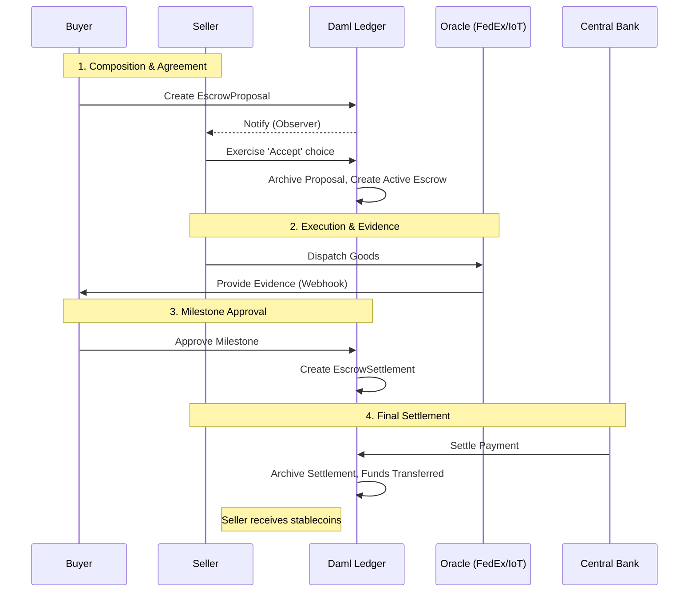

# Stablecoin Escrow Platform (DAML-Based)

## Overview

This project explores the design of a **privacy-preserving, multi‑party
stablecoin escrow platform** implemented using **DAML (Digital Asset
Modeling Language)** and deployed on a **Canton-style distributed ledger
network**.

------------------------------------------------------------------------

## Architecture & Workflow

### System Architecture
The platform is built on a modern, decoupled stack ensuring high performance and cryptographic certainty.



### Escrow Lifecycle Workflow
A multi-actor flow demonstrating the transition from proposal to final stablecoin settlement.



------------------------------------------------------------------------

## Getting Started

### Prerequisites
- **Go 1.24+**
- **Java 17 (LTS)**
- **DPM (Daml Package Manager)**
- **Docker & Docker Compose**

### Development Environment

The project provides a unified management console via `Makefile`.

```bash
# View all available strategies
make help

# START the full stack (Ledger + API + Frontend)
make up

# STOP everything
make down
```

### Verification
Verify the full lifecycle functionality using the integration tests:

```bash
# Runs standard unit tests
make test

# Runs full ledger integration suite (requires active ledger)
make integration-test
```

------------------------------------------------------------------------

## Repository Structure

```text
/cmd                    - Entry points for API and Oracle Simulator
/internal/api           - REST handlers and middleware
/internal/ledger        - Modular Daml JSON API V2 client
/internal/services      - Core business logic and metrics orchestration
/contracts/stablecoin-* - Multi-package Daml contracts (Interface, Implementation, Tests)
/frontend               - Astro-based dashboard with Tailwind CSS
/docs                   - API documentation (Swagger)
/.gemini                - Project memory and architectural guardrails
```

------------------------------------------------------------------------

## Product Goals

1. **Enable trust-minimized escrow using stablecoins**
2. **Support milestone-based payments**
3. **Allow dispute mediation**
4. **Provide private contract execution**
5. **Integrate external triggers (oracles, webhooks)**

------------------------------------------------------------------------

## Key Achievements (Phase 4)

- **Modular Backend:** Deconstructed monolithic clients into specialized modules for better maintainability.
- **Admin Dashboard:** Branded UI with role-based oversight and real-time metrics.
- **Daml 3.x Compatibility:** Fully aligned with LF 2.1 and Canton authorization (actAs) requirements.
- **Observability:** Real-time system performance and ledger throughput visualizations.
- **UX Flow:** End-to-end lifecycle support from agreement drafting to final settlement.
