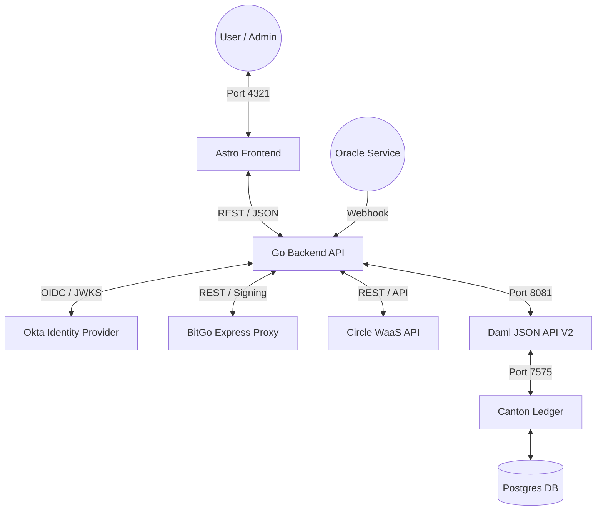
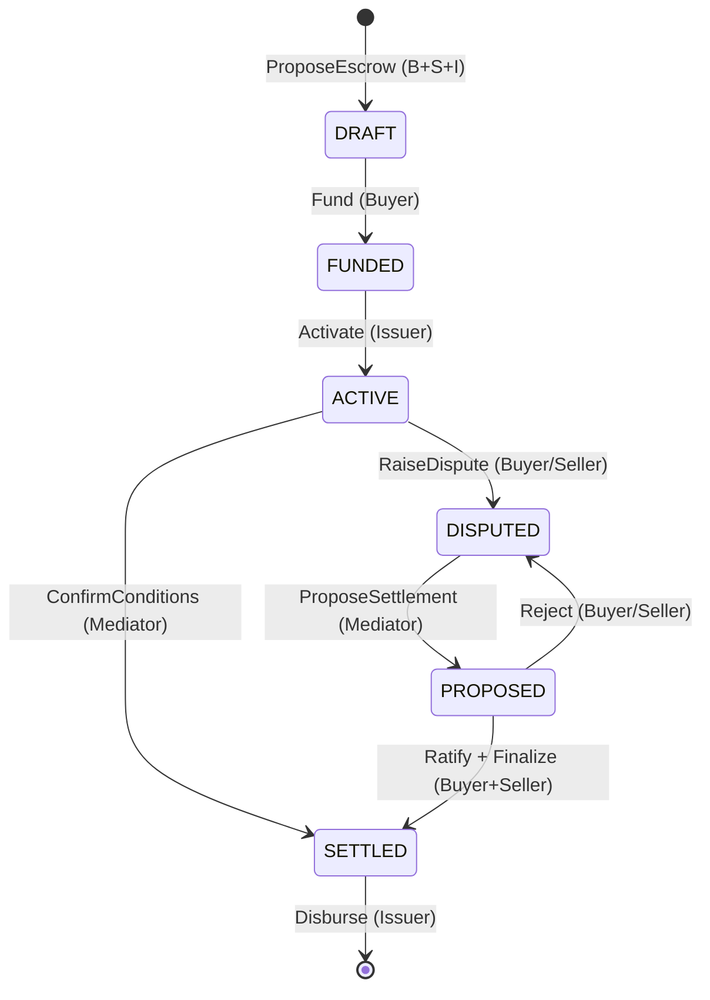

# Stablecoin Escrow Platform (DAML-Based)

## Overview

This project implements a **high-assurance, privacy-preserving stablecoin escrow platform** using **DAML (Digital Asset Modeling Language)** and a **Canton distributed ledger**. It follows a rigorous formal escrow process designed for tokenized reserves.

👉 **[Get Started with Installation & Setup](./GET_STARTED.md)**

------------------------------------------------------------------------

## High-Assurance Architecture

### System Stack

### Canton Network & Token Standards

This platform is built on the **Canton Network**, a privacy-enabled, interoperable blockchain designed for institutional finance. It leverages industry-standard protocols to ensure secure B2B stablecoin pledging and escrow:

* **CIP-0056 Token Standard:** Implements the "holding", "lockable", and "transferable" interfaces required for secure, interoperable stablecoin movement (e.g., USDCx via BitGo/Circle).
* **Multi-Custody Support:** Dynamically pluggable providers for institutional-grade vaulting:
    * **BitGo Enterprise:** Secure signing via BitGo Express local proxy.
    * **Circle WaaS:** Direct integration with Developer-Controlled programmable wallets.
* **Canton OpenZeppelin Stablecoin/CDP Module:** Utilizes production-ready Daml templates for Collateralized Debt Positions (CDP) and standard CIP-0056 holding mechanisms.
* **Validator APIs (Splice):** Employs high-level validator endpoints for automated escrow workflows and external party signing (e.g., trusted escrow agents).
* **Noves Data & Analytics:** Integrates real-time indexed data for tracking token holdings, transaction history, and wallet metrics across the Canton Network.

### Escrow Lifecycle (Formal Model)

Refined per `ESCROW-PROCESS.md` to ensure bilateral consent and tripartite authority.

------------------------------------------------------------------------

## Key Features

### 1. Robust State Machine (Phase 5)

Strict transition guards ensure funds cannot be released until conditions are met or bilateral agreement is reached in a dispute.

* **DRAFT:** Terms agreed, but asset not yet deposited.
* **FUNDED:** Asset locked by Issuer, awaiting activation.
* **ACTIVE:** Escrow is live and conditions are being monitored.
* **DISPUTED:** Adjudication phase initiated.
* **PROPOSED:** Mediated settlement awaiting party ratification.

### 2. Distributed Sovereignty (Phase 6)

The platform has transitioned from a single-node sandbox to a **tripartite distributed topology**, enforcing strict data sovereignty and authority:

*   **Tripartite Authority Model:** Every escrow requires co-signature from **Buyer**, **Seller**, and **Issuer (Bank)**. This prevents unauthorized state transitions and ensures institutional compliance.
*   **Multi-Node Isolation:** Each participant operates their own **Canton Node**, ensuring that private contract data (e.g., specific terms or evidence) only resides on the participants' infrastructure.
*   **Intelligent Routing:** The Go backend utilizes a `MultiLedgerClient` to intelligently route commands to the specific node hosting the primary submitter, maintaining zero-trust isolation.

### 3. CIP-0056 & Institutional Tokens

Native support for **CIP-0056** ensures the platform can interoperate with real stablecoins:
*   **Lockable Interface:** Assets are cryptographically locked in the escrow contract, preventing double-spending while the escrow is `ACTIVE`.
*   **Transferable Interface:** Final settlement triggers authoritative transfers using standardized token choices, ensuring compatibility with major institutional issuers.

### 4. Deep Health Diagnostics (Phase 9)

The Go backend aggregates real-time diagnostics from all critical sub-systems:
*   **Database:** Latency-aware connectivity checks.
*   **Ledger:** Verifies template availability and package propagation.
*   **Oracle:** Validates security credentials and trigger readiness.
The frontend dashboard provides a live cockpit for monitoring these states with 15s polling.

### 5. High-Assurance Identity (Phase 9)

Transitioned from static mocks to a production-grade **OIDC Identity Bridge**:
*   **Okta Integration:** Cryptographic JWT validation via JWKS signatures.
*   **JIT Provisioning:** Automated allocation of ledger parties and user metadata upon first login.
*   **Scoped Authority:** OIDC scopes (e.g., `system:admin`) are mapped directly to cryptographically enforced ledger permissions.
*   **Dynamic Discovery:** Automatically resolves Package IDs and Party IDs at runtime, ensuring environment resilience.

------------------------------------------------------------------------

## Analytics & Operational Velocity (Phase 6.3)

The platform integrates a high-assurance analytics layer powered by **Noves-ready logic** to provide real-time visibility into the escrow lifecycle.

### 1. The Operational Velocity Dashboard
Accessible via `/metrics`, this dashboard visualizes the platform's efficiency using:
*   **Stage Duration Heatmap:** Tracks the average minutes spent in each escrow state (`DRAFT`, `FUNDED`, `ACTIVE`, `PROPOSED`), identifying systemic bottlenecks.
*   **Conversion Funnel:** Visualizes the "drop-off" and success rate from initial proposal through to final settlement.
*   **System Health:** Real-time monitoring of P95/P99 latencies, command success rates, and ACS (Active Contract Set) size.

------------------------------------------------------------------------

## Repository Structure

* `/cmd`: Entry points for API and Oracle Simulator.
* `/internal`: Modular Go backend (Ledger Client, Service Layer, REST Handlers).
* `/contracts`: Multi-package Daml structure (Interfaces, Implementation, Tests).
* `/frontend`: Astro-based dashboard with DataCloud LNF styling.
* `ESCROW-PROCESS.md`: The formal process specification.
* `REGULATORY_CONFORMANCE.md`: Details on GDPR/CCPA and data sovereignty.
