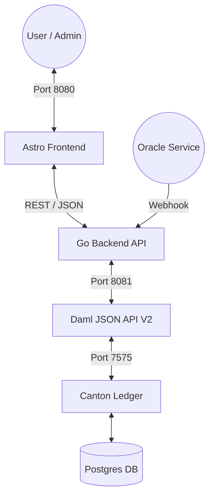
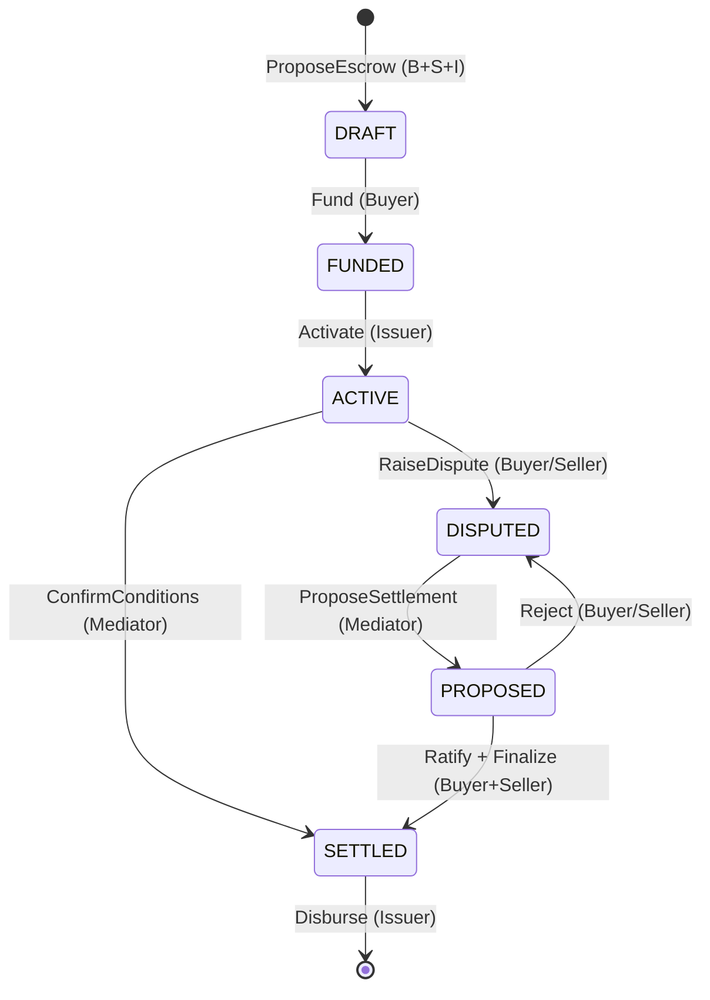

# Stablecoin Escrow Platform (DAML-Based)

## Overview

This project implements a **high-assurance, privacy-preserving stablecoin escrow platform** using **DAML (Digital Asset Modeling Language)** and a **Canton distributed ledger**. It follows a rigorous formal escrow process designed for tokenized reserves.

------------------------------------------------------------------------

## High-Assurance Architecture

### System Stack



### Canton Network & Token Standards

This platform is built on the **Canton Network**, a privacy-enabled, interoperable blockchain designed for institutional finance. It leverages industry-standard protocols to ensure secure B2B stablecoin pledging and escrow:

* **CIP-0056 Token Standard:** Implements the "holding" and "transfer" interfaces required for secure, interoperable stablecoin movement (e.g., USDCx via BitGo/Circle).
* **Canton OpenZeppelin Stablecoin/CDP Module:** Utilizes production-ready Daml templates for Collateralized Debt Positions (CDP) and standard CIP-0056 holding mechanisms.
* **Validator APIs (Splice):** Employs high-level validator endpoints for automated escrow workflows and external party signing (e.g., trusted escrow agents).
* **Noves Data & Analytics:** Integrates real-time indexed data for tracking token holdings, transaction history, and wallet metrics across the Canton Network.

### Escrow Lifecycle (Formal Model)

Refined per `ESCROW-PROCESS.md` to ensure bilateral consent and tripartite authority.



------------------------------------------------------------------------

## Key Features (Phase 5 Refactor)

### 1. Robust State Machine

Strict transition guards ensure funds cannot be released until conditions are met or bilateral agreement is reached in a dispute.

* **DRAFT:** Terms agreed, but asset not yet deposited.
* **FUNDED:** Asset locked by Issuer, awaiting activation.
* **ACTIVE:** Escrow is live and conditions are being monitored.
* **DISPUTED:** Adjudication phase initiated.
* **PROPOSED:** Mediated settlement awaiting party ratification.

### 2. Tripartite Authority Model

* **Issuer (Bank):** Signatory on all states; controls final disbursement.
* **Buyer & Seller:** Co-signers on terms and settlement ratification.
* **Mediator:** Authoritative adjudicator for conditions and settlement proposals.

### 3. Self-Healing Integration

The Go backend features a **Dynamic Discovery Engine** that automatically resolves Package IDs and Party IDs at runtime, ensuring the stack is environment-agnostic and resilient to ledger resets.

### 4. API Request Validation & DTOs

All HTTP endpoints utilize strict Data Transfer Objects (DTOs) (e.g., `ProposeEscrowRequest`, `FundEscrowRequest`) with explicit `.Validate()` methods before interacting with the core ledger services. This isolates business logic from malformed or dirty web payloads and prevents mass-assignment vulnerabilities.

------------------------------------------------------------------------

## Getting Started

### Prerequisites

* **Go 1.24+**
* **Java 17 (LTS)**
* **DPM (Daml Package Manager)**
* **Docker & Docker Compose**

### Development Environment

```bash
# Start the full stack (Ledger + API + Frontend)
make up

# Run verification suite
make test
make integration-test
```

------------------------------------------------------------------------

## Repository Structure

* `/cmd`: Entry points for API and Oracle Simulator.
* `/internal`: Modular Go backend (Ledger Client, Service Layer, REST Handlers).
* `/contracts`: Multi-package Daml structure (Interfaces, Implementation, Tests).
* `/frontend`: Astro-based dashboard with DataCloud LNF styling.
* `ESCROW-PROCESS.md`: The formal process specification.
