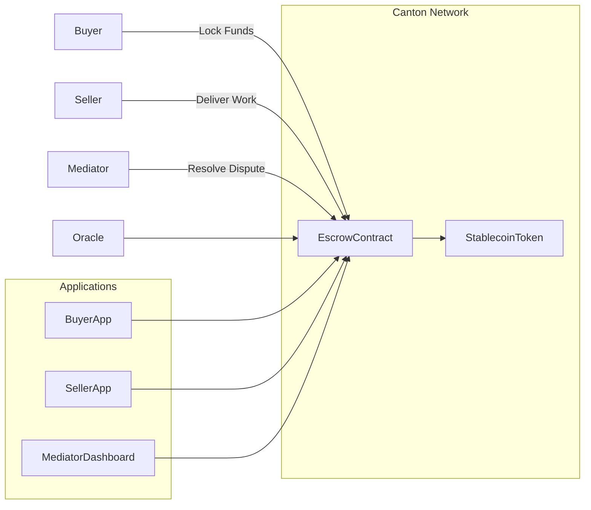

# Stablecoin Escrow Platform (DAML-Based)

## Overview

This project explores the design of a **privacy-preserving, multi‑party
stablecoin escrow platform** implemented using **DAML (Digital Asset
Modeling Language)** and deployed on a **Canton-style distributed ledger
network**.

The goal is to replicate and extend models similar to **Trustless
Work--style milestone escrow**, while leveraging DAML's strengths:

- Rights and obligations modeling
- Multi-party atomic workflows
- Native privacy controls
- Deterministic contract execution

Rather than representing escrow as **account balances controlled by
functions**, DAML models the escrow as a **living agreement contract**
between defined parties.

------------------------------------------------------------------------

## Product Goals

Primary goals:

1. **Enable trust-minimized escrow using stablecoins**
2. **Support milestone-based payments**
3. **Allow dispute mediation**
4. **Provide private contract execution**
5. **Integrate external triggers (oracles, shipping confirmations,
    APIs)**

Target use cases:

- Freelance marketplaces
- Supply chain settlements
- Marketplace payments
- B2B milestone contracts
- Cross‑border contractor payments

------------------------------------------------------------------------

## Core Concepts

### Rights and Obligations Model

Unlike account-based smart contracts, DAML represents agreements between
explicit parties.

Each contract defines:

- **Signatories** --- parties legally bound by the contract
- **Observers** --- parties with visibility but not authority
- **Choices** --- authorized actions that transition contract state

For escrow this means:

| Role | Responsibility |
| ---------- | -------------------- |
| Buyer | Locks funds |
| Seller | Delivers work |
| Mediator | Resolves disputes |
| Issuer | Stablecoin backing |

------------------------------------------------------------------------

## Architecture

### High Level System Components

The system is composed of:

- DAML Ledger (Canton)
- Stablecoin Token Contract
- Escrow Contract Templates
- Oracle / API Integrations
- Client Applications
- Identity / Party Management

#### Architecture Diagram



------------------------------------------------------------------------

## Contract Model

### Escrow Lifecycle

1. Buyer and Issuer create escrow contract
2. Funds are locked
3. Seller performs work
4. Buyer approves release OR mediator resolves dispute
5. Settlement contract records final payout

Lifecycle states:

```text
Created → Locked → Delivered → Released / Refunded
```

------------------------------------------------------------------------

## Example DAML Escrow Template

``` daml
module StablecoinEscrow where

template StablecoinEscrow
  with
    issuer : Party
    buyer : Party
    seller : Party
    mediator : Party
    amount : Decimal
    currency : Text
    description : Text
  where
    signatory buyer, issuer
    observer seller, mediator

    choice ReleaseFunds : ContractId EscrowSettlement
      controller buyer
      do
        create EscrowSettlement with
          recipient = seller, amount, currency, status = "Completed"

    choice RefundBuyer : ContractId EscrowSettlement
      controller mediator
      do
        create EscrowSettlement with
          recipient = buyer, amount, currency, status = "Refunded"
```

Settlement template:

``` daml
template EscrowSettlement
  with
    recipient : Party
    amount : Decimal
    currency : Text
    status : Text
  where
    signatory recipient
```

------------------------------------------------------------------------

## Privacy Model

DAML uses **need‑to‑know privacy**.

Only the following parties can see the escrow contract:

- Buyer
- Seller
- Mediator
- Issuer

Other escrows on the network remain invisible.

This enables enterprise-grade financial agreements while still
benefiting from distributed ledger guarantees.

------------------------------------------------------------------------

## Oracle / External Event Integration

External systems can trigger escrow actions via **DAML triggers or
integration services**.

Examples:

| Event | Result |
| ------ | ----------------------- |
| Shipping confirmation | auto‑unlock milestone |
| Oracle price check | validate collateral |
| Delivery API | trigger payment release |
| Time expiry | automatic refund |

Integration approaches:

- REST gateway
- Event streaming (Kafka)
- Webhooks
- Oracle providers

------------------------------------------------------------------------

## Comparison with Other Frameworks

### DAML vs Solidity (Ethereum)

|  Feature                   | DAML                            | Solidity |
|  ------------------------- | ------------------------------- | --------------------- |
|  Programming Model         | Rights & obligations            | Account-based |
|  Privacy                   | Built-in selective disclosure   | Fully public |
|  Multi-party workflows     | Native                          | Manual logic |
|  Contract safety           | Strong type system              | More error prone |
|  Determinism               | Guaranteed                      | Depends on contract |
|  Legal contract alignment  | Strong                          | Weak |

Pros of DAML:

- Multi‑party transaction atomicity
- Built‑in privacy
- Strong permissions model
- Easier representation of real agreements

Cons:

- Smaller ecosystem
- Fewer public developer tools
- Requires specialized infrastructure (Canton)

------------------------------------------------------------------------

### DAML vs Stellar Smart Contracts

  Feature                        DAML                Stellar
  ------------------------------ ------------------- ---------------
  Privacy                        Private contracts   Public ledger
  Workflow complexity            High                Moderate
  Token ecosystem                Smaller             Mature
  Smart contract flexibility     Very high           Limited
  Multi-chain interoperability   Canton networks     Stellar only

Pros of Stellar:

- Large existing payment ecosystem
- Fast settlement
- Simpler deployment

Pros of DAML:

- Enterprise-grade agreement modeling
- Rich workflow capabilities
- Fine-grained privacy

------------------------------------------------------------------------

# Future Extensions

Potential roadmap:

### Phase 1

Basic escrow contracts Stablecoin settlement Buyer/Seller UI

### Phase 2

Milestone payments Oracle integrations Automated dispute workflows

### Phase 3

Multi‑chain settlement Tokenized invoices DAO‑style mediation pools

### Phase 4

Marketplace integrations Supply chain escrow Enterprise compliance
tooling

------------------------------------------------------------------------

# Repository Structure

    /contracts
        StablecoinEscrow.daml

    /services
        oracle-service
        payment-gateway

    /apps
        buyer-portal
        seller-portal
        mediator-dashboard

    /docs
        architecture.md

------------------------------------------------------------------------

# Key Advantages of This Approach

- Privacy-preserving escrow
- Clear legal contract representation
- Atomic multi-party transactions
- Native dispute resolution
- Modular architecture

This design enables a **next-generation programmable escrow layer for
digital commerce**.

------------------------------------------------------------------------

# Next Exploration

Future technical work may include:

- Oracle integration patterns
- Multi-ledger settlement
- Token standards for DAML Finance
- Compliance / KYC enforcement layers
