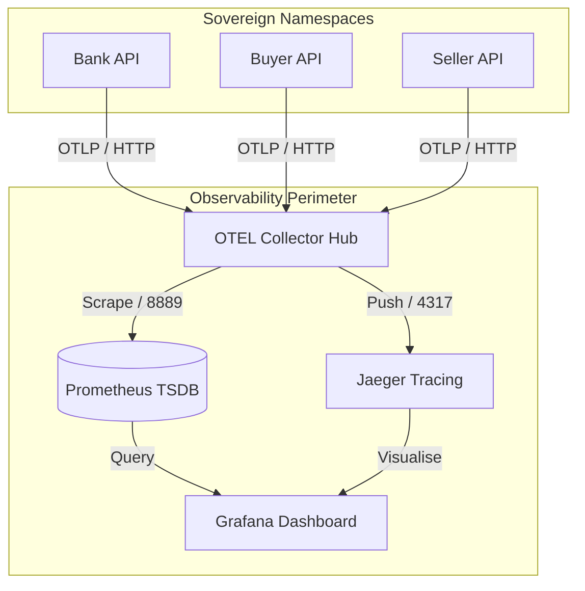

# High-Assurance Observability Guide

This document authoritatively defines the telemetry architecture and operational visibility model for the Stablecoin Escrow platform.

## Telemetry Flow (Tripartite Orchestration)

The platform utilizes a **Push-Based OpenTelemetry (OTEL)** model to ensure real-time visibility across isolated participant namespaces.

## Institutional Context Propagation

To meet SOC2 and Financial Service auditing standards, every institutional request is authoritatively tagged with metadata that bridges the gap between high-level business logic and low-level system performance.

| Attribute | Purpose | High-Assurance Source |
| :--- | :--- | :--- |
| `account.id` | Identifies the unique participant (e.g., Buyer `sub`). | Okta OIDC JWT |
| `contract.id` | Identifies the specific Daml Escrow Contract. | URL Path / Ledger Context |
| `service.name` | Identifies the source node (`escrow-api`). | Configuration |
| `env` | Identifies the deployment perimeter (`dev`, `prod`). | Environment Variable |

## Metrics Strategy (The 3-Tier Model)

### 1. System Level (Platform Stability)
- **TPS (Transactions Per Second):** Global request volume across all tripartite nodes.
- **P95 Latency Heatmaps:** High-resolution response time distribution to identify systemic bottlenecks.
- **Deep Health:** Aggregated status of Postgres, Canton, and Oracle sub-systems.

### 2. Account Level (Client Performance)
- **Request Volume by Account:** Track usage and quotas for individual institutional clients.
- **Error Rate Percentage:** Monitor stability for specific participants, enabling sovereign troubleshooting.

### 3. Contract Level (Operational Velocity)
- **Lifecycle Latency:** Authoritatively track the time taken to move between escrow states (e.g., `ACTIVE` → `SETTLED`).
- **Settlement Funnel:** Identify where institutional settlements are delayed or disputed.

## Local Operational Tools

| Tool | URL | Purpose |
| :--- | :--- | :--- |
| **Jaeger** | `http://localhost:16686` | Real-time distributed tracing of tripartite spans. |
| **Grafana** | `http://localhost:3000` | Unified performance dashboards (Prometheus powered). |
| **Prometheus** | `http://localhost:9090` | Time-series query engine for institutional metrics. |
| **OTEL Logs** | `make otel-logs` | Follow the authoritative telemetry flush in real-time. |
